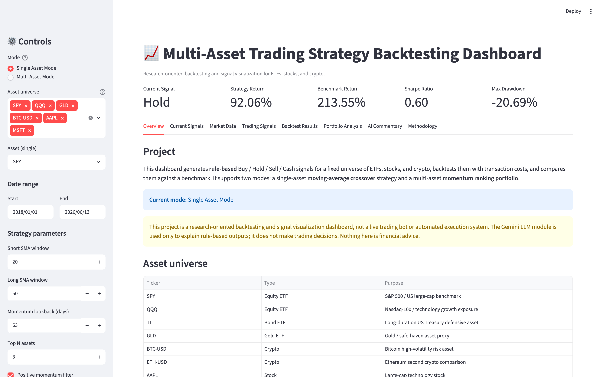
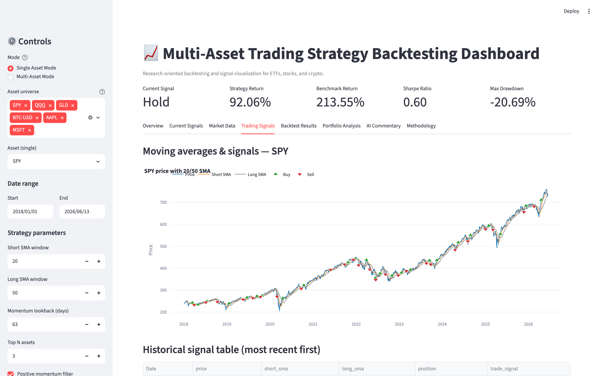
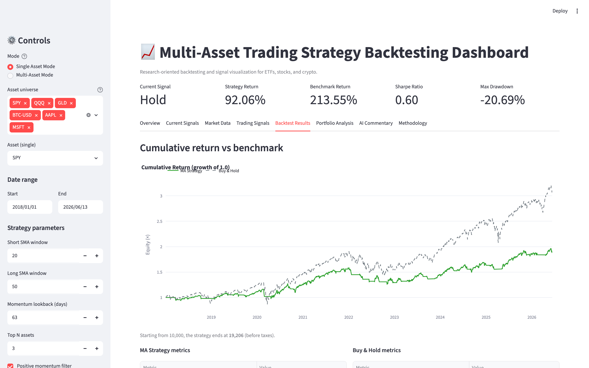
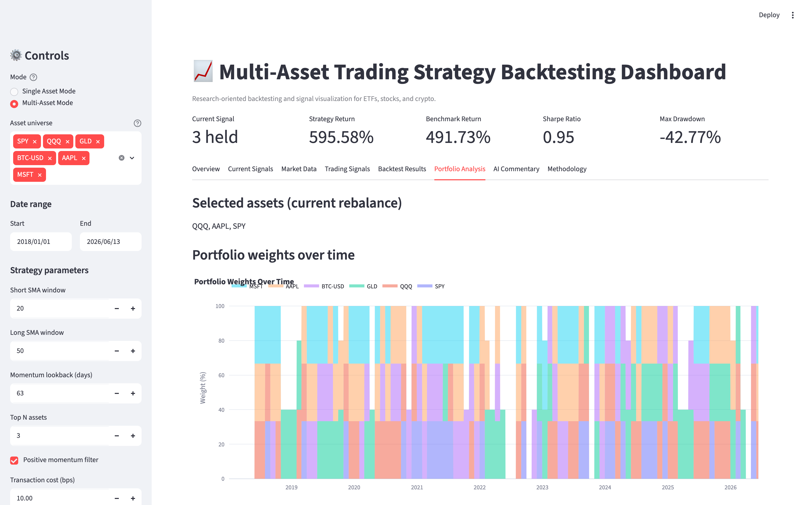

# LLM-Enhanced Multi-Asset Trading Strategy Backtesting Dashboard

A Python + Streamlit dashboard that generates **rule-based** Buy / Hold / Sell / Cash
signals across ETFs, stocks, and crypto, backtests them with transaction costs, and
compares them against benchmarks. An **optional** Gemini LLM module writes research-style
commentary that *explains* the rule-based output — it never makes trading decisions.

> ⚠️ **This project is a research-oriented backtesting and signal visualization dashboard,
> not a live trading bot or automated execution system. The Gemini LLM module is used only
> to explain rule-based outputs; it does not make trading decisions. Nothing here is
> financial advice.**

---

## Purpose

Built to connect investing interest with financial analytics, Python, and AI-assisted
research tooling — and to demonstrate, for a finance/analytics portfolio:

- market data handling (yfinance)
- systematic Buy / Sell / Hold / Cash signal logic
- single-asset and multi-asset analysis
- backtesting discipline (look-ahead bias prevention, transaction costs)
- risk metrics and benchmark comparison
- a clean Streamlit dashboard
- an optional, safety-constrained LLM commentary layer

## Key features

- **Single Asset Mode** — moving-average crossover strategy on one asset.
- **Multi-Asset Mode** — monthly momentum-ranking portfolio across several assets.
- Buy/Sell markers, equity curves, drawdown, correlation heatmap, risk-return scatter.
- Risk metrics: total return, annualized return, volatility, Sharpe, max drawdown, Calmar, win rate.
- Benchmark comparison (buy-and-hold / equal-weight).
- Transaction cost assumptions (default 10 bps per trade).
- Optional Gemini AI commentary, fully disabled and graceful without an API key.

## Asset universe

| Ticker | Type | Purpose |
|---|---|---|
| SPY | Equity ETF | S&P 500 / US large-cap benchmark |
| QQQ | Equity ETF | Nasdaq-100 / technology growth exposure |
| TLT | Bond ETF | Long-duration US Treasury defensive asset |
| GLD | Gold ETF | Gold / safe-haven asset proxy |
| BTC-USD | Crypto | Bitcoin high-volatility risk asset |
| ETH-USD | Crypto | Ethereum second crypto comparison |
| AAPL | Stock | Large-cap technology stock |
| MSFT | Stock | Large-cap technology stock |

## Modes

### Single Asset Mode
Select one asset and a moving-average crossover strategy. View the current signal and a
plain-English reason, a price chart with short/long SMAs and Buy/Sell markers, the strategy
equity curve vs buy-and-hold, drawdown, and a full metrics table.

### Multi-Asset Mode
Select several assets and a momentum-ranking portfolio. View a current signal table,
momentum ranking, model allocation, portfolio performance vs an equal-weight benchmark,
drawdown, a correlation heatmap, and a risk-return scatter.

## Strategy logic

**Moving Average Crossover (single asset)**

```text
raw_signal = 1 when short SMA > long SMA, else 0
position   = raw_signal shifted by 1 day  (avoids look-ahead bias)
Buy  -> position turns 0 -> 1
Sell -> position turns 1 -> 0
Hold -> stays invested
Cash -> stays flat
Defaults: short_window = 20, long_window = 50
```

**Momentum Ranking Portfolio (multi-asset)**

```text
Each month, rank assets by trailing momentum (default 63 trading days).
Select the top N (default 3); optionally require positive momentum.
Equal-weight the selected assets; others get 0% weight.
Weights are shifted by 1 day before earning returns (avoids look-ahead bias).
Defaults: lookback = 63, top_n = 3, rebalance = monthly, max weight = 40%
```

## LLM commentary module

`src/llm_commentary.py` uses the **Gemini API only to explain** the rule-based signals and
metrics. The rule-based strategy is the single source of truth — the LLM never decides or
overrides Buy / Hold / Sell / Cash.

- The API key is read from **Streamlit secrets**, a local **`.env`** file, or **environment
  variables** — never hard-coded.
- `.env` is git-ignored; copy `.env.example` to `.env` and add your key.
- Without a key, the app runs normally and shows: *"AI commentary is disabled because no
  Gemini API key was found."*
- A **Generate AI Commentary** button triggers the call — it never runs automatically on
  page refresh.
- Output is a concise (~150–250 word) research note and always ends with an educational
  disclaimer.

## Installation

```bash
# (optional) create a virtual environment
python3 -m venv .venv
source .venv/bin/activate   # Windows: .venv\Scripts\activate

pip install -r requirements.txt
```

To enable AI commentary (optional):

```bash
cp .env.example .env
# then edit .env and set GEMINI_API_KEY=...
```

## How to run locally

```bash
pip install -r requirements.txt
streamlit run app.py
```

The app opens in your browser. No API key is required for the core backtesting MVP.

## Project structure

```text
multi-asset-trading-dashboard/
├── app.py                  # Streamlit dashboard (modes, tabs, layout)
├── requirements.txt
├── README.md
├── .gitignore
├── .env.example
├── src/
│   ├── __init__.py
│   ├── data_loader.py      # yfinance download + cleaning
│   ├── indicators.py       # SMA, returns, momentum, drawdown
│   ├── strategies.py       # MA crossover + momentum ranking
│   ├── backtester.py       # single-asset + portfolio backtests
│   ├── metrics.py          # risk/return metrics
│   ├── plots.py            # Plotly chart builders
│   └── llm_commentary.py   # optional Gemini commentary
├── notebooks/
│   └── prototype_backtest.ipynb
└── outputs/
    └── screenshots/        # add dashboard screenshots here
```

## Dashboard

The dashboard has eight tabs: **Overview, Current Signals, Market Data, Trading Signals,
Backtest Results, Portfolio Analysis, AI Commentary, Methodology.**

### Screenshots

**Overview — headline metric cards, asset universe, disclaimer**



**Trading Signals (Single Asset Mode) — price with short/long SMA and Buy/Sell markers**



**Backtest Results — strategy vs buy-and-hold equity curve, metrics, drawdown**



**Portfolio Analysis (Multi-Asset Mode) — momentum-ranked portfolio weights over time**



> Screenshots use default settings (2018–present). Figures are illustrative backtest
> output, not a forecast.

## Example outputs

- Current signal card (single asset) with a plain-English reason.
- Current signal + model allocation tables (multi-asset).
- Strategy vs benchmark equity curve and drawdown.
- Correlation heatmap and risk-return scatter.

## Limitations

- Historical backtesting does not guarantee future performance.
- The model uses simplified assumptions (e.g. 252-day annualisation for all assets).
- Transaction costs are estimated; slippage and liquidity are not fully modelled.
- yfinance data is suitable for educational research, not institutional-grade trading.
- The system is not a live execution bot and does not connect to brokers or place trades.
- Gemini commentary may be inaccurate or incomplete — treat it as an explanatory layer,
  not a decision engine. It does not replace independent financial analysis.

## Future improvements

- Volatility targeting, risk parity, stop-loss rules, regime filter (e.g. price > 200-day SMA).
- Rolling Sharpe ratio and model allocation history.
- Deployment to Streamlit Community Cloud.
- Alpha Vantage / Polygon data sources via environment variables or Streamlit secrets.
- Exportable AI commentary (Markdown / PDF) and alternate prompt styles.
- Unit tests and an optional Dockerfile.

## Disclaimer

This project is for **learning, research, and portfolio demonstration only**. It is **not** a
live trading bot, **not** an automated execution system, and **not** financial advice. The
Gemini LLM module explains rule-based outputs and does not create or override signals.
